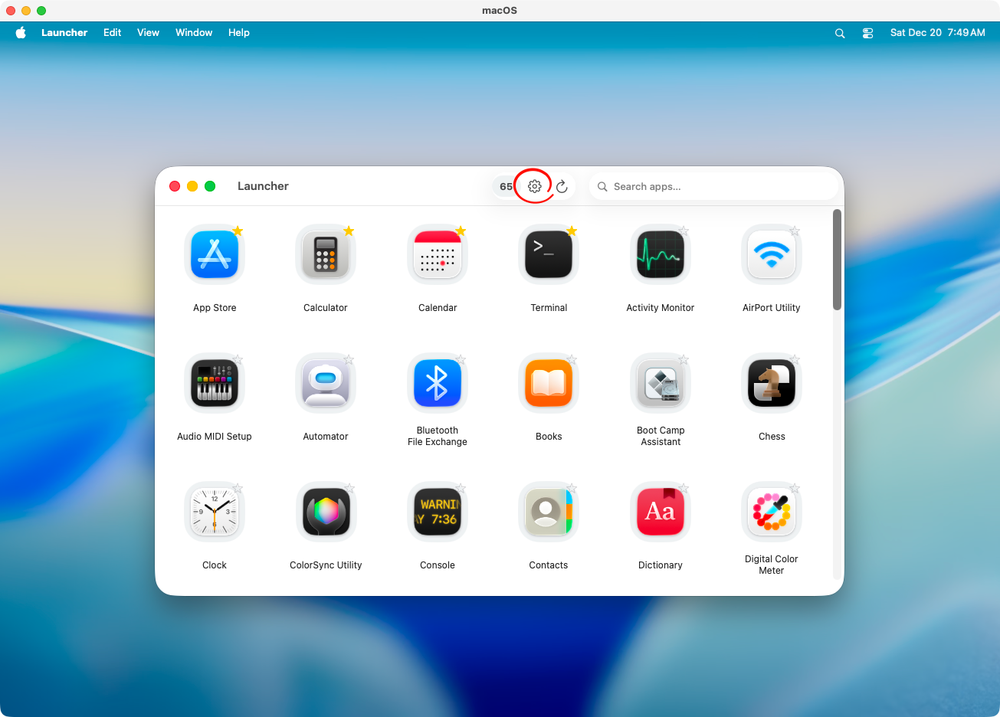
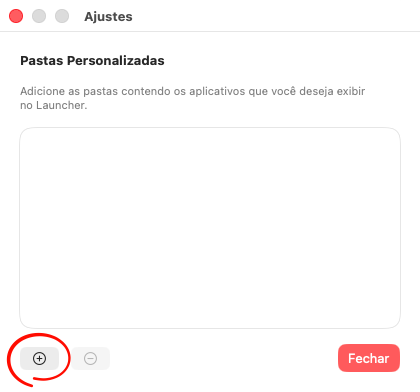
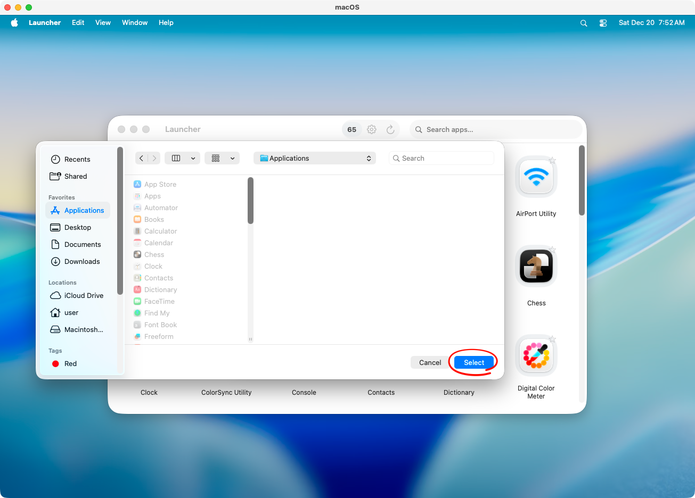
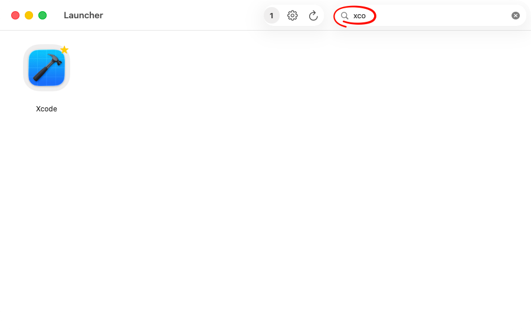
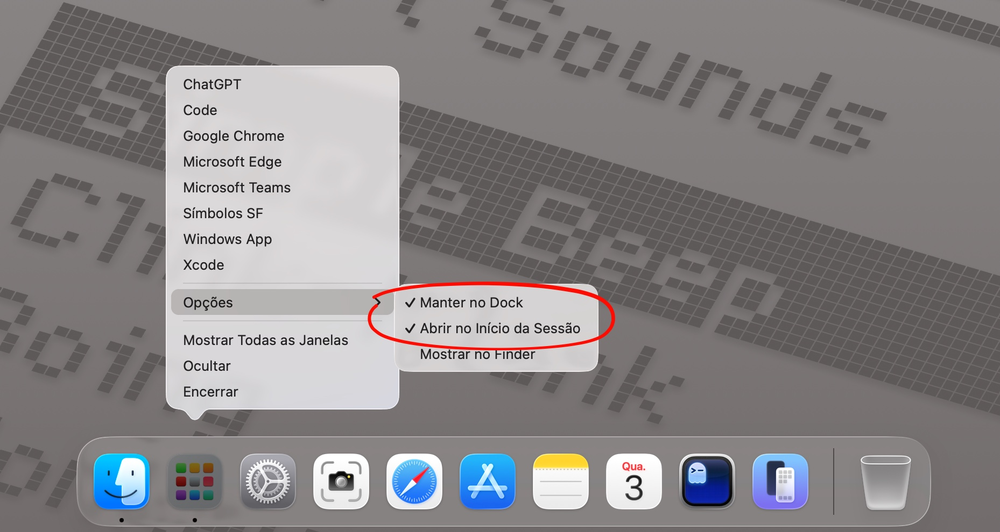

[Versão em Português](README_pt.md)

## Index

- [Application Catalog](#application-catalog)
- [Favorites](#favorites)
- [Application Search](#application-search)
- [Optional Items](#optional-items)

## Application Catalog

By default, the catalog is composed of native system applications, applications installed in the user context, and components distributed via Cryptex, a mechanism used by macOS for the dynamic delivery of system components.

| **Location** | **Description** |
| --- | --- |
| /System/Applications | Native system applications. |
| /Applications | Applications installed by the user. |
| /Users/[user]/Applications | Applications installed in the user context. |
| Cryptex | Applications and components dynamically delivered by macOS. |

You can add custom locations containing the applications you want to display in the catalog, useful for temporary apps or WebApps. Click the **Settings** icon to open the configuration window.

Click **[ + ]** and select the desired location.

You can display applications inside a specific application bundle, for example: /Applications/Xcode.app/Contents/Applications/

Click **Close** to exit the **Settings** window.

## Favorites

To pin an application to the top of the catalog, you can mark it as a favorite. Click the bookmark icon of the application or use the context menu and select **Add to Favorites**.

## Application Search

The Launcher's application search uses the Spotlight API, allowing you to filter by application name, bundle name, and even applications not listed in the catalog.

## Optional Items

Keep the Launcher in the Dock and allow it to open at session start. This ensures that applications marked as favorites are loaded in the context menu when the system starts.

