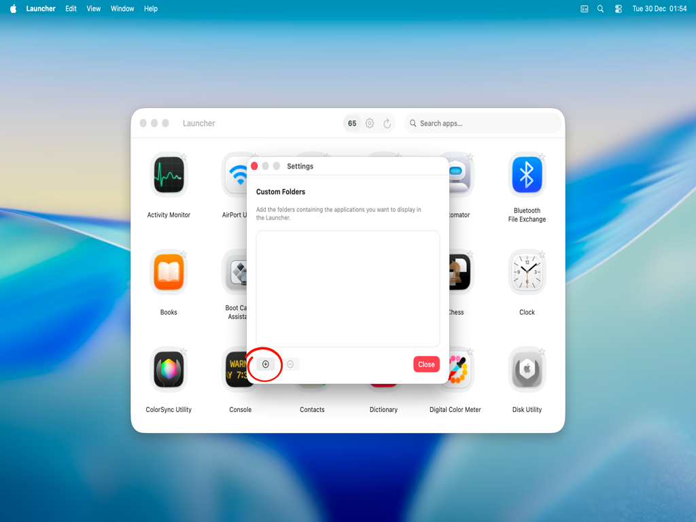
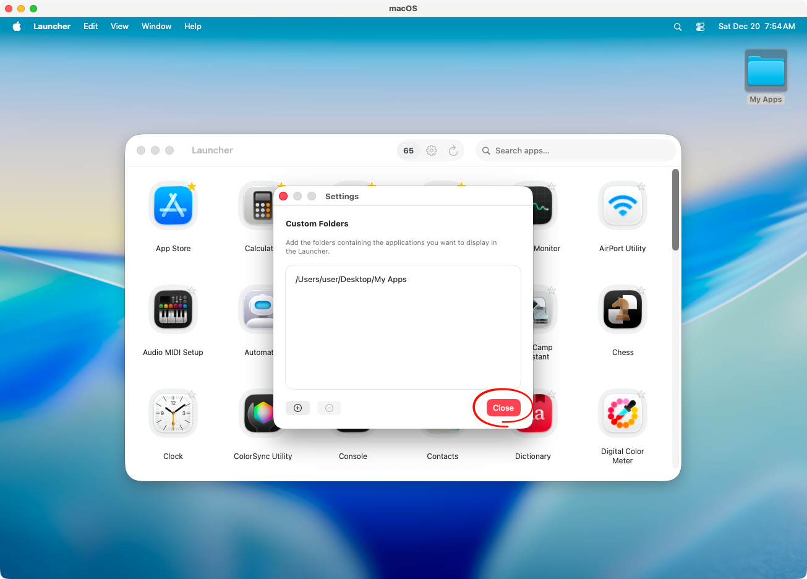
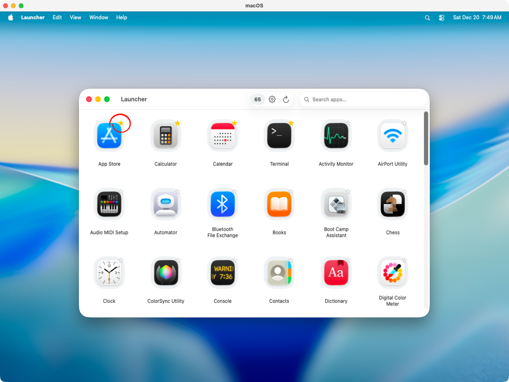
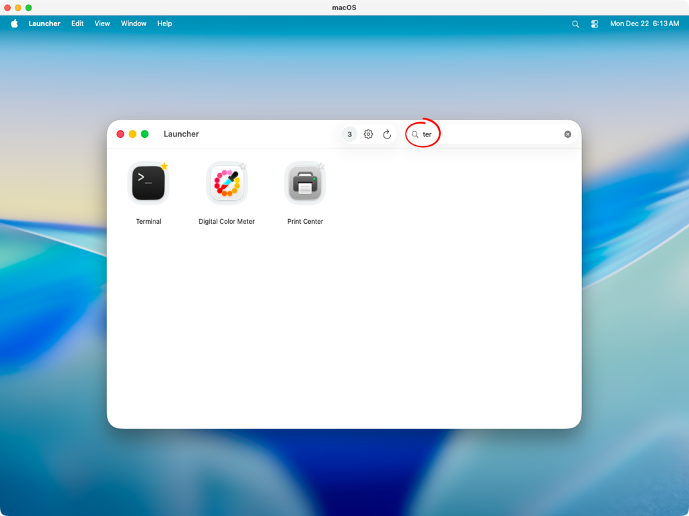

[English Version](README_en.md)

## Índice

- [Catálogo de aplicativos](#catálogo-de-aplicativos)
- [Favoritos](#favoritos)
- [Busca por aplicativos](#busca-por-aplicativos)
- [Opcionais](#opcionais)

## Catálogo de aplicativos

Por padrão, o catálogo é composto por aplicações nativas do sistema, aplicações instaladas no contexto do usuário e componentes distribuídos via Cryptex, mecanismo utilizado pelo macOS para entrega dinâmica de componentes do sistema.

| **Local** | **Descrição** |
| --- | --- |
| /System/Applications | Aplicações nativas do sistema. |
| /Applications | Aplicativos instalados pelo usuário. |
| /Users/[user]/Applications | Aplicativos instalados no contexto do usuário |
| Cryptex | Aplicações e componentes entregues dinamicamente pelo macOS. |

É possível adicionar locais personalizados contendo os aplicativos que você deseja exibir no catálogo, útil para aplicativos temporários ou WebApps. Clique no ícone **Ajustes** para exibir a janela de configurações.

Clique em **[ + ]** e selecione o local desejado.

Você pode exibir no catálogo aplicativos de um pacote específico, exemplo: /Applications/Xcode.app/Contents/Applications/

Clique em **Fechar** para encerrar a janela **Ajustes**.

## Favoritos

Para fixar um aplicativo no início do catálogo você pode defini-lo como favorito, clique no marcador do ícone do aplicativo ou use o menu contextual e selecione **Adicionar aos Favoritos**.

## Busca por aplicativos

A busca por aplicativos do Launcher usa a API do Spotlight, portanto você pode filtrar pelo nome do aplicativo, nome do pacote e aplicativos que não estão listados no catálogo.

## Opcionais

Mantenha o Launcher no Dock e permita que seja aberto no inicio da sessão, isso garante que os aplicativos fixados como favoritos sejam carregados no menu contextual ao iniciar o sistema.

